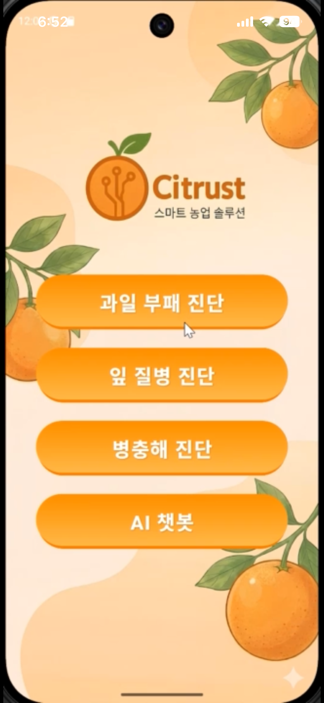

# 🍊 Citrust

**Citrust**는 감귤 및 과일의 건강 상태를 AI로 진단하는 안드로이드 애플리케이션입니다.  
사용자가 과일 이미지를 입력하면, AI 모델이 부패 여부, 잎 질병, 병충해 존재 여부를 분석하여  
농가 및 사용자에게 직관적인 결과를 제공합니다.

---

## 📌 프로젝트 목적

- 감귤 농가의 **실시간 작물 상태 파악** 지원
- 육안으로 확인하기 어려운 **부패·질병·해충 문제를 AI로 자동 분석**
- 스마트 농업(Smart Farming)을 위한 **모바일 진단 도구 제공**

---

## 🧠 주요 기능

- 🖼️ **이미지 기반 진단**
  - 사용자가 촬영하거나 선택한 과일 이미지 분석

- 🤖 **AI 기반 진단**
  - 부패 진단
  - 감귤 잎 질병 진단
  - 병충해 탐지 및 종류 분류

- 📊 **시각적 결과 출력**
  - 탐지된 객체에 바운딩 박스 표시
  - 텍스트 기반 분석 결과 제공
---

## 데모 영상

아래 이미지를 클릭하면 Dogtor 앱 데모 영상을 확인할 수 있습니다.

---

## 🧩 사용 기술 스택

### Android
- **Kotlin**
- **Jetpack Compose** (UI)
- **MVVM Architecture**

### AI & API
- **Roboflow API**
- **YOLO 기반 Computer Vision 모델**

---

## 🧪 사용된 AI 모델

### 1️⃣ Rotten Fruit Detector
- 감귤 부패 여부 판별
- YOLO 기반 사전 학습 모델
- 약 **4,400장 데이터** 사용
- 라벨: `good orange`, `bad orange`

### 2️⃣ Citrus Leaf Disease Model
- 감귤 잎 질병 진단
- Transfer Learning 적용
- 약 **2,500장 데이터**
- 라벨: `blackspot`, `canker`, `melanose` 등

### 3️⃣ Pest Detection Model
- 해충 위치 및 종류 탐지
- YOLOv11 기반 모델
- 약 **7,300장 데이터**
- **19종 해충 분류 가능** (개미, 나방, 벌, 거미 등)

---

## 📱 앱 화면 흐름

1. 메인 화면에서 진단 종류 선택
   - 부패 진단
   - 잎 질병 진단
   - 병충해 진단

2. 이미지 입력 후 AI 분석 진행

3. “AI 분석 중” 로딩 화면 표시

4. Roboflow API를 통해 이미지 분석

5. 결과 화면 출력
   - 바운딩 박스
   - 텍스트 결과 (예: “이 감귤은 부패했습니다.”)

---

## 🎨 UI 디자인

- Jetpack Compose 기반 UI
- 친환경·농업 컨셉 디자인
- 직관적인 버튼 중심 인터페이스
- 농장 배경 일러스트 적용

---

## 🚀 향후 개선 사항

- 분석 결과 이력 저장 기능
- 질병/해충별 상세 설명 제공
- 농가 맞춤형 관리 알림 기능
- 클라우드 기반 데이터 관리

---

## 👩‍💻 개발자

- **변은아**
- Pyeongtaek University  
- Smart Content 전공

---

## 📄 라이선스

본 프로젝트는 학습 및 연구 목적으로 제작되었습니다.
